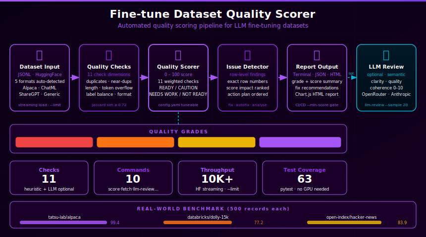

# Fine-tune Dataset Quality Scorer

> Built autonomously by [NEO](https://heyneo.com) — your fully autonomous AI coding agent. &nbsp; [](https://marketplace.visualstudio.com/items?itemName=NeoResearchInc.heyneo)



A CLI tool that analyses JSONL fine-tuning datasets and tells you — before you burn GPU hours — whether your data is actually worth training on.

---

## Why This Exists

Fine-tuning a model costs money and time. Bad training data silently produces bad models. Most teams discover data quality problems only after training, when:

- The model hallucinates more than the base model
- It learned from duplicate or near-duplicate examples (wasted compute)
- Short or malformed records caused silent truncation
- Field inconsistencies corrupted the training signal
- The dataset was technically valid but covered only a narrow slice of the target domain

This tool runs those checks in seconds and gives a **score out of 100** with specific, actionable fixes — plus smart domain analysis that tells you what your dataset is *missing*, not just what's wrong with it.

---

## Two Layers of Analysis

| Layer | Question answered | Commands |
|---|---|---|
| **Data integrity** | Is the data well-formed and clean? | `score`, `fix`, `autofix`, `quick` |
| **Content coverage** | Is the data sufficient for its purpose? | `analyse` |
| **LLM quality review** | Do the outputs actually answer the instructions? | `llm-review` |
| **Cross-dataset safety** | Does test data leak from training data? | `crosscheck` |

---

## What It Checks

| Check | What it detects |
|-------|----------------|
| **Format validation** | All records are valid JSON dicts; auto-detects schema (Alpaca / ChatML / ShareGPT / Prompt-Completion / Generic) |
| **Field consistency** | Every record has the same set of fields; reports which rows are missing which fields |
| **Missing values** | `null` or empty-string field values; format-aware — optional fields (e.g. Alpaca `input`) are excluded |
| **Exact duplicates** | Identical records; reports which rows are duplicates of which |
| **Near-duplicates** | High Jaccard word-set similarity (≥ 0.72 by default); catches paraphrased duplicates that exact-match misses |
| **Output diversity** | Jaccard similarity on output/completion/response/assistant fields; flags near-identical outputs even when inputs differ |
| **Text length** | Primary text field word-count outliers (too short < 5 words, or too long > 2000 words) |
| **Token length** | Estimates token count per record (`word_count × 1.3`); flags records likely to overflow the context window |
| **Instruction quality** | Alpaca-only — flags vague instructions (`"help me"`, `"do something"`), multi-task records, and short instructions |
| **Language consistency** | Detects unexpected language/script switches across records |
| **Label balance** | Class imbalance for classification datasets — severe at > 5:1, moderate at > 3:1 |

---

## Score Interpretation

```
92 – 100   READY       High quality — proceed with fine-tuning
80 –  91   CAUTION     Minor issues — review flagged checks first
60 –  79   NEEDS WORK  Significant problems — fix before training
 0 –  59   NOT READY   Critical issues found — do not train yet
```

---

## Supported Formats

Format is auto-detected from the first few records — no flags needed:

| Format | Key fields | Notes |
|--------|-----------|-------|
| Alpaca | `instruction`, `input`, `output` | `input` is optional — empty `input` is not penalised |
| ChatML | `messages` (array with `role`/`content`) | |
| Prompt/Completion | `prompt`, `completion` | |
| ShareGPT | `conversations` (array with `from`/`value`) | |
| Generic | any other field combination | |

---

## Installation

```bash
# Core only
pip install typer rich pyyaml

# With HuggingFace fetch support
pip install typer rich pyyaml datasets huggingface-hub

# With LLM review support
pip install typer rich pyyaml anthropic

# Everything
pip install -e ".[all]"
```

Then set up your API keys:

```bash
cp .env.example .env
# Edit .env and fill in OPENROUTER_API_KEY and/or ANTHROPIC_API_KEY
```

---

## Quick Start

```bash
# Score a local dataset
dqs score examples/datasets/sample_dataset.jsonl

# Fetch a HuggingFace dataset and score it immediately
dqs fetch tatsu-lab/alpaca --limit 500

# Deep analysis with domain gap suggestions
dqs analyse examples/datasets/sample_dataset.jsonl

# LLM-based quality review (needs OPENROUTER_API_KEY or ANTHROPIC_API_KEY)
dqs llm-review examples/datasets/sample_dataset.jsonl --sample 20
```

---

## All Commands

### `score` — full quality report

```bash
dqs score your_dataset.jsonl
dqs score your_dataset.jsonl --format json
dqs score your_dataset.jsonl --format json  --output report.json
dqs score your_dataset.jsonl --format html  --output report.html
dqs score your_dataset.jsonl --min-score 80   # CI/CD gate
```

| Flag | Description |
|------|-------------|
| `--format` / `-f` | `terminal` (default), `json`, or `html` |
| `--output` / `-o` | Save report to a file |
| `--min-score` | Exit code 1 if score is below this threshold |
| `--config` / `-c` | Path to a custom `config.yaml` |

---

### `fetch` — pull any HuggingFace dataset → JSONL

```bash
# Fetch 500 Alpaca records and score immediately
dqs fetch tatsu-lab/alpaca --limit 500

# Fetch Hacker News stories (type=1), mapping title→prompt and text→completion
dqs fetch open-index/hacker-news --limit 500 \
    --filter-field type --filter-value 1 \
    --prompt-field title --completion-field text

# Save without scoring
dqs fetch databricks/databricks-dolly-15k --limit 1000 --output dolly.jsonl --no-score
```

| Flag | Description |
|------|-------------|
| `--split` / `-s` | Dataset split (`train`, `test`, …) |
| `--limit` / `-n` | Max records to fetch (default 1000) |
| `--output` / `-o` | Output JSONL path |
| `--prompt-field` | HF column to map to `prompt` |
| `--completion-field` | HF column to map to `completion` |
| `--filter-field` / `--filter-value` | Keep only rows where field equals value |
| `--score` / `--no-score` | Run quality analysis after fetch (default: yes) |

---

### `llm-review` — LLM-based quality assessment

Samples records and asks a model to score each on 0–10 for **clarity**, **output quality**, and **coherence** (does the output actually answer the instruction?).

```bash
# Uses OPENROUTER_API_KEY or ANTHROPIC_API_KEY from .env automatically
dqs llm-review your_dataset.jsonl --sample 20

# Integrate LLM score into the overall quality score (adds 15% weight)
dqs llm-review your_dataset.jsonl --sample 20 --include-in-score

# Save full JSON report
dqs llm-review your_dataset.jsonl --format json --output llm_report.json
```

Backend selection (first match wins):

1. `--api-key sk-or-...` or `OPENROUTER_API_KEY` → OpenRouter *(no extra packages needed)*
2. `ANTHROPIC_API_KEY` + `pip install anthropic` → Anthropic direct

| Flag | Description |
|------|-------------|
| `--api-key` | API key (overrides env vars) |
| `--model` / `-m` | Model to use (auto-selected if omitted) |
| `--sample` / `-n` | Records to sample (default 20) |
| `--include-in-score` | Add LLM review as a weighted check in the overall score |
| `--format` / `-f` | `terminal` or `json` |

---

### `analyse` — deep analysis with domain intelligence

```bash
dqs analyse your_dataset.jsonl
dqs analyse your_dataset.jsonl --domain coding
```

Combines data-quality scoring with content-coverage analysis:

1. **Detected domain** — auto-infers `coding`, `qa`, `translation`, `summarization`, `classification`, `conversation`, or `general`
2. **Domain coverage stats** — e.g. for coding: languages detected, task type breakdown, edge-case presence
3. **What this dataset is lacking** — domain-specific list of missing content types
4. **Data-quality issues table** — all checks sorted by score impact
5. **Row-level findings** — every specific record that needs attention, with exact row numbers
6. **Action plan** — prioritised fix list ordered by score gain

---

### `quick` — bare score for scripts

```bash
dqs quick your_dataset.jsonl
# → 99.4
```

Returns only the number — nothing else on stdout. Perfect for CI/CD.

---

### `fix` — actionable suggestions with row numbers

```bash
dqs fix your_dataset.jsonl
```

Reports every failing check with row numbers:

```
  1. Missing Values — 3 empty/null field values across 3 records. Affected rows: 4, 12, 23
  2. Exact Duplicates — 2 duplicate records found. Remove: row 17 (dup of row 5), row 25 (dup of row 2)
  3. Text Length — 1 outlier record (avg 6.7 words). too short: rows 29
```

---

### `autofix` — remove duplicates automatically

```bash
dqs autofix your_dataset.jsonl
dqs autofix your_dataset.jsonl --output cleaned.jsonl
dqs autofix your_dataset.jsonl --dry-run
```

Removes exact duplicate records and writes a cleaned JSONL file with a before/after score.

---

### `compare` — side-by-side comparison

```bash
dqs compare dataset_a.jsonl dataset_b.jsonl
```

Prints a full report for each, then a per-check breakdown table showing exactly where they diverge.

---

### `stats` — field and label statistics

```bash
dqs stats your_dataset.jsonl
```

Shows field presence counts, non-empty counts, and label distribution.

---

### `crosscheck` — train/test leakage detection

```bash
dqs crosscheck train.jsonl test.jsonl
```

Detects records from the test set that have leaked from the training set using exact-match fingerprinting.

---

## Example Datasets

The `examples/datasets/` folder contains sample data used for testing and demonstration:

| File | Source | Records | Notes |
|------|--------|---------|-------|
| `sample_dataset.jsonl` | Included | 30 | Clean Alpaca-format demo dataset |
| `fresh_dataset.jsonl` | Included | — | Another sample for testing |
| `alpaca_500.jsonl` | [`tatsu-lab/alpaca`](https://huggingface.co/datasets/tatsu-lab/alpaca) | 500 | Score: **99.4/100** — near-perfect clean dataset |
| `dolly_500.jsonl` | [`databricks/databricks-dolly-15k`](https://huggingface.co/datasets/databricks/databricks-dolly-15k) | 500 | Score: **77.2/100 NEEDS_WORK** — real issues: empty `context` on 367 records, open_qa vs creative_writing imbalance (5.82:1) |
| `hacker_news_stories.jsonl` | [`open-index/hacker-news`](https://huggingface.co/datasets/open-index/hacker-news) | 500 | Score: **83.9/100 CAUTION** — most stories are URL-only links with no completion text; not usable for fine-tuning without pairing with comment threads |
| `hacker_news_comments.jsonl` | [`open-index/hacker-news`](https://huggingface.co/datasets/open-index/hacker-news) | 300 | Comments have text bodies but no instruction context — orphaned half-pairs |

Regenerate the fetched datasets:

```bash
# Alpaca
dqs fetch tatsu-lab/alpaca --limit 500 --output examples/datasets/alpaca_500.jsonl

# Dolly
dqs fetch databricks/databricks-dolly-15k --limit 500 --output examples/datasets/dolly_500.jsonl

# Hacker News stories (type=1)
dqs fetch open-index/hacker-news --limit 500 \
    --filter-field type --filter-value 1 \
    --prompt-field title --completion-field text \
    --output examples/datasets/hacker_news_stories.jsonl

# Hacker News comments (type=2)
dqs fetch open-index/hacker-news --limit 300 \
    --filter-field type --filter-value 2 \
    --completion-field text \
    --output examples/datasets/hacker_news_comments.jsonl
```

---

## Real-world Benchmark Results

Scores produced on 500-record samples with the default config:

| Dataset | Score | Grade | Key issues found |
|---------|-------|-------|-----------------|
| `tatsu-lab/alpaca` | **99.4** | READY | 1 near-duplicate output pair |
| `databricks/databricks-dolly-15k` | **77.2** | NEEDS_WORK | 367 empty `context` fields; label imbalance 5.82:1 (open_qa 128 vs creative_writing 22) |
| `open-index/hacker-news` (stories) | **83.9** | CAUTION | Most completions missing (URL-only stories); not a fine-tuning dataset as-is |

LLM review scores (via OpenRouter, `anthropic/claude-haiku-4-5`, sample=30):

| Dataset | Clarity | Quality | Coherence | Verdict |
|---------|---------|---------|-----------|---------|
| `tatsu-lab/alpaca` | 8.8/10 | 7.5/10 | 8.6/10 | PASS |
| `databricks/databricks-dolly-15k` | 8.4/10 | 6.8/10 | 8.1/10 | PASS |
| `open-index/hacker-news` (stories) | 5.5/10 | 0.0/10 | 0.0/10 | FAIL — no outputs |

---

## CI/CD Integration

```bash
# Fail build if score drops below 80
dqs score data/train.jsonl --min-score 80

# Parse JSON for custom logic
dqs score data/train.jsonl --format json --output /tmp/report.json
python3 -c "
import json, sys
r = json.load(open('/tmp/report.json'))
print(f'Score: {r[\"overall_score\"]} ({r[\"grade\"]})')
sys.exit(0 if r['overall_score'] >= 80 else 1)
"
```

---

## Configuration

Edit `config.yaml` to customise weights and thresholds:

```yaml
weights:
  json_format: 0.08
  field_consistency: 0.16
  missing_values: 0.16
  duplicates: 0.12
  near_duplicates: 0.08
  output_diversity: 0.07
  text_length: 0.07
  token_length: 0.07
  instruction_quality: 0.05
  language_consistency: 0.04
  label_quality: 0.10

thresholds:
  field_consistency_pass: 0.97
  field_consistency_soft: 0.90
  missing_values_pass: 0.98
  missing_values_soft: 0.92
  duplicate_soft: 0.97
  near_duplicate_similarity: 0.72   # Jaccard threshold — lower catches more paraphrases
  near_duplicate_sample: 500
  min_text_words: 5
  max_text_words: 2000
  max_token_estimate: 2048
  min_instruction_words: 5

score_bands:
  ready: 92
  caution: 80
  needs_work: 60
```

---

## Project Structure

```
Fine-tune-Dataset-Quality-Scorer/
├── src/
│   ├── __init__.py
│   ├── __main__.py          # python -m src entry point
│   ├── checks.py            # All quality checks, domain detection, HF loader, scoring
│   ├── llm_reviewer.py      # LLM-based review (OpenRouter + Anthropic SDK)
│   ├── main.py              # Typer CLI — 10 commands
│   └── reporter.py          # Terminal (Rich), JSON, and HTML report generators
├── tests/
│   ├── conftest.py
│   ├── test_checks.py       # 63 tests
│   └── fixtures/
│       ├── good_dataset.jsonl
│       ├── bad_dataset.jsonl
│       └── mixed_dataset.jsonl
├── examples/
│   ├── datasets/
│   │   ├── sample_dataset.jsonl         # included demo (Alpaca format, 30 records)
│   │   ├── fresh_dataset.jsonl          # included demo
│   │   ├── alpaca_500.jsonl             # fetched — tatsu-lab/alpaca
│   │   ├── dolly_500.jsonl              # fetched — databricks/databricks-dolly-15k
│   │   ├── hacker_news_stories.jsonl    # fetched — open-index/hacker-news (type=1)
│   │   └── hacker_news_comments.jsonl   # fetched — open-index/hacker-news (type=2)
│   └── reports/
│       └── alpaca_report.html           # generated HTML report
├── assets/
│   └── infographic.svg
├── .env                     # your API keys (gitignored)
├── .env.example             # template — copy to .env
├── config.yaml              # weights, thresholds, score bands
├── pyproject.toml           # pip install -e ".[all]"
├── requirements.txt
└── README.md
```

---

## Running Tests

```bash
python3 -m pytest tests/ -v
```

63 tests covering all 11 checks, scoring logic, format-aware optional fields, near-duplicate edge cases, output diversity, token length, instruction quality, language consistency, weighted thresholds, format detection, and the HuggingFace loader. No GPU or external service required.

---

## License

MIT
