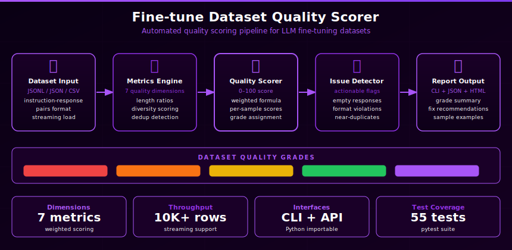

# Fine-tune Dataset Quality Scorer

> Built autonomously by [NEO](https://heyneo.com) — your fully autonomous AI coding agent. &nbsp; [](https://marketplace.visualstudio.com/items?itemName=NeoResearchInc.heyneo)



A CLI tool that analyses JSONL fine-tuning datasets and tells you — before you burn GPU hours — whether your data is actually worth training on.

---

## Why This Exists

Fine-tuning a model costs money and time. Bad training data silently produces bad models. Most teams discover data quality problems only after training, when:

- The model hallucinates more than the base model
- It learned from duplicate or near-duplicate examples (wasted compute)
- Short or malformed records caused silent truncation
- Field inconsistencies corrupted the training signal
- The dataset was technically valid but covered only a narrow slice of the target domain

This tool runs those checks in seconds and gives a **score out of 100** with specific, actionable fixes — plus smart domain analysis that tells you what your dataset is *missing*, not just what's wrong with it.

---

## Two Layers of Analysis

The tool separates two distinct problems that are often confused:

| Layer | Question answered | Commands |
|---|---|---|
| **Data integrity** | Is the data well-formed and clean? | `score`, `fix`, `autofix`, `quick` |
| **Content coverage** | Is the data sufficient for its purpose? | `analyse` |
| **Cross-dataset safety** | Does test data leak from training data? | `crosscheck` |

A dataset can score 100/100 on integrity and still produce a poor fine-tuned model because it covers only one programming language, one question type, or one difficulty level. The `analyse` command catches that.

---

## What It Checks

| Check | What it detects |
|-------|----------------|
| **Format validation** | All records are valid JSON dicts; detects schema (Alpaca / ChatML / etc.) |
| **Field consistency** | Every record has the same set of fields; reports which rows are missing which fields |
| **Missing values** | `null` or empty-string field values; format-aware — optional fields (e.g. Alpaca `input`) are excluded |
| **Exact duplicates** | Identical records; reports which rows are duplicates of which |
| **Near-duplicates** | High Jaccard word-set similarity (≥ 0.85); catches same instruction + different input pairs that exact-dup check misses |
| **Output diversity** | Jaccard similarity on output/completion/assistant fields; flags records with near-identical outputs even when inputs differ |
| **Text length** | Primary text field word-count outliers (too short or too long) |
| **Token length** | Estimates token count per record (`word_count × 1.3`); flags records likely to overflow the model's context window |
| **Instruction quality** | Alpaca-only — flags vague instructions (`"help me"`, `"do something"`), multi-task records, and instructions shorter than 4 words |
| **Language consistency** | Detects unexpected language/script switches across records; catches copy-paste errors from multilingual sources |
| **Label balance** | Class imbalance for classification datasets (imbalance ratio > 10 = fail) |

---

## Score Interpretation

```
90 – 100   READY       High quality — proceed with fine-tuning
75 –  89   CAUTION     Minor issues — review flagged checks first
50 –  74   NEEDS WORK  Significant problems — do not train yet
 0 –  49   NOT READY   Critical issues found — fix before training
```

---

## Supported JSONL Formats

Format is auto-detected from the first record — no flags needed:

| Format | Key fields | Notes |
|--------|-----------|-------|
| Alpaca | `instruction`, `input`, `output` | `input` is treated as optional — empty `input` does **not** penalise the missing-values score |
| ChatML | `messages` (array with `role`/`content`) | |
| Prompt/Completion | `prompt`, `completion` | |
| ShareGPT | `conversations` (array with `from`/`value`) | |
| Generic | any other field combination | |

---

## Quick Start

### Install

```bash
pip install typer rich pyyaml
```

### Score a dataset

```bash
python3 src/main.py score your_dataset.jsonl
```

### Deep analysis with domain intelligence

```bash
python3 src/main.py analyse your_dataset.jsonl
```

Sample output:

```
Overall Score: 100.0/100 — Grade: READY
Records analysed: 20  |  Format: chatml

Detected domain: coding  (confidence 100%)

Domain coverage
  Languages detected   : Python  (1 of 7 common)
  Task types           : write / implement: 19  |  debug / fix: 0  |  explain: 1  |  refactor: 0
  Edge-case examples   : ✗ none detected
  Error-handling       : ✓ found

What this dataset is lacking  (coding domain)
  ▸ Add multiple programming languages — JavaScript, SQL, and Bash improve model versatility
  ▸ Include debugging/fixing tasks (~30% of data): 'find the bug in this function'
  ▸ Add edge-case examples: empty inputs, None/null values, boundary conditions
  ▸ Vary task complexity: short snippets (5–10 lines), medium functions, multi-function programs
  ▸ Add code-explanation tasks: 'what does this code do?' — teaches analytical reasoning
  ▸ Include unit-test writing tasks to teach correctness awareness
  ▸ Add refactoring tasks: 'improve this code for readability / performance'
```

---

## All Commands

### `score` — full quality report

```bash
python3 src/main.py score your_dataset.jsonl
python3 src/main.py score your_dataset.jsonl --format json
python3 src/main.py score your_dataset.jsonl --format json  --output report.json
python3 src/main.py score your_dataset.jsonl --format html  --output report.html
```

Options:

| Flag | Description |
|------|-------------|
| `--format` / `-f` | `terminal` (default), `json`, or `html` |
| `--output` / `-o` | Save JSON or HTML report to a file |
| `--min-score` | Exit code 1 if score is below this threshold (CI/CD gate) |
| `--config` / `-c` | Path to a custom `config.yaml` |

---

### `analyse` — deep analysis with domain intelligence

```bash
python3 src/main.py analyse your_dataset.jsonl
python3 src/main.py analyse your_dataset.jsonl --domain coding
```

The most comprehensive command. Combines data-quality scoring with content-coverage analysis:

1. **Detected domain** — auto-infers whether the dataset is `coding`, `qa`, `translation`, `summarization`, `classification`, `conversation`, or `general`
2. **Domain coverage stats** — e.g. for coding: languages detected, task type breakdown, edge-case presence
3. **What this dataset is lacking** — domain-specific list of missing content types
4. **Data-quality issues table** — all checks including warnings (not just hard failures), sorted by score impact
5. **Row-level findings** — every specific record that needs attention, with exact row numbers
6. **Action plan** — prioritised fix list ordered by score gain

Options:

| Flag | Description |
|------|-------------|
| `--domain` / `-d` | Override auto-detection (`coding`, `qa`, `translation`, `summarization`, `classification`, `conversation`, `general`) |
| `--config` / `-c` | Path to a custom `config.yaml` |

---

### `quick` — bare score for scripts

Returns only the number — nothing else on stdout:

```bash
python3 src/main.py quick your_dataset.jsonl
# → 87.4
```

---

### `fix` — actionable suggestions with row numbers

```bash
python3 src/main.py fix your_dataset.jsonl
```

Reports on every **failing** check with row numbers and "and N more" for large lists:

```
  1. Missing Values — 3 empty/null field values across 3 records. Affected rows: 4, 12, 23
  2. Exact Duplicates — 2 duplicate records found. Remove: row 17 (dup of row 5), row 25 (dup of row 2)
  3. Output Diversity — 1 near-duplicate output pair. rows 8 ↔ 19 (sim=0.92)
  4. Text Length — 1 outlier record (avg 6.7 words). too short: rows 29
  5. Token Length — 2 records exceed 2048 estimated tokens. rows 11, 27
  6. Instruction Quality — 1 vague instruction. rows 3
```

> **Tip:** `fix` only reports failing checks. Use `analyse` to also surface warnings (checks that passed but scored below 100%).

---

### `autofix` — remove duplicates automatically

```bash
python3 src/main.py autofix your_dataset.jsonl
python3 src/main.py autofix your_dataset.jsonl --output cleaned.jsonl
python3 src/main.py autofix your_dataset.jsonl --dry-run
```

Removes exact duplicate records and writes a cleaned JSONL file. Shows a before/after score so you can confirm the fix worked.

```
Removals
  – Row 17  def reverse_string(s): return s[::-1]
  – Row 25  Write a Python function to reverse a string.

  Removed : 2 duplicate record(s)
  Records : 30 → 28
  Score   : 95.1 → 97.8 / 100

Cleaned dataset written to: your_dataset.fixed.jsonl
```

Options:

| Flag | Description |
|------|-------------|
| `--output` / `-o` | Output file path (default: `<name>.fixed.jsonl`) |
| `--dry-run` | Preview removals without writing any file |
| `--config` / `-c` | Path to a custom `config.yaml` |

---

### `crosscheck` — train/test leakage detection

```bash
python3 src/main.py crosscheck train.jsonl test.jsonl
```

Detects records from the training set that have leaked into the test set — a common problem when assembling train/test splits from the same source. Uses exact-match fingerprinting across the full record.

```
Train/Test Leakage Report
  train.jsonl  : 500 records
  test.jsonl   : 100 records
  Leaked records: 3

  Row in test   Duplicate of (train row)
  ──────────────────────────────────────
  7             42
  31            17
  88            204

  Recommendation: Remove 3 leaked record(s) from test.jsonl before evaluation.
```

---

### `compare` — side-by-side comparison

```bash
python3 src/main.py compare train.jsonl test.jsonl
```

Prints a full report for each dataset, then shows which scores higher and a **per-check breakdown table** pinpointing exactly where the two datasets diverge:

```
Comparison
Dataset 1 scores higher by 4.9 points

                      Check-by-check breakdown
 Check                good_dataset.jsonl   sample_dataset.jsonl   Δ (2 vs 1)
 Json Format          100.0                100.0                  =
 Field Consistency    100.0                100.0                  =
 Missing Values       100.0                 98.3                  -1.7
 Duplicates           100.0                 74.7                  -25.3
 Near Duplicates      100.0                 98.9                  -1.1
 Output Diversity     100.0                100.0                  =
 Text Length          100.0                 93.3                  -6.7
 Token Length         100.0                100.0                  =
 Instruction Quality  100.0                100.0                  =
 Lang Consistency     100.0                100.0                  =
 Label Quality        100.0                100.0                  =
```

---

### `stats` — field and label statistics

```bash
python3 src/main.py stats your_dataset.jsonl
```

Shows field presence counts, non-empty counts, and label distribution.

---

## Domain Intelligence

The `analyse` command auto-detects the subject-matter domain of your dataset and surfaces content gaps specific to that domain.

### Supported domains and what they check

| Domain | Auto-detected when… | Coverage stats shown |
|--------|--------------------|--------------------|
| `coding` | Instructions mention Python, JavaScript, SQL, algorithms, functions | Languages detected, task type breakdown (write/debug/explain/refactor), edge-case presence |
| `qa` | Instructions are questions (what/who/how/why/when/where) | Question-type distribution across 6 types |
| `translation` | Instructions include "translate", language names | Target languages detected |
| `summarization` | Instructions include "summarize", "summarise", "key points" | — |
| `classification` | Dataset has a `label`/`category`/`class` field | — (label balance is handled by the label quality check) |
| `conversation` | Dataset uses ChatML or ShareGPT format | — |
| `general` | No strong domain signal detected | — |

### Manual override

If auto-detection gets it wrong (e.g. a small dataset with few domain keywords), override it:

```bash
python3 src/main.py analyse my_data.jsonl --domain coding
```

---

## CI/CD Integration

### Option A — built-in `--min-score` gate (simplest)

```bash
python3 src/main.py score data/train.jsonl --min-score 75
# Exits 0 if score ≥ 75, exits 1 if below — ready to use in any CI pipeline
```

### Option B — parse the JSON report

```bash
# Step 1: generate the report
python3 src/main.py score data/train.jsonl --format json --output /tmp/report.json

# Step 2: fail the build if below threshold
python3 -c "
import json, sys
r = json.load(open('/tmp/report.json'))
print(f\"Score: {r['overall_score']} ({r['grade']})\")
sys.exit(0 if r['overall_score'] >= 75 else 1)
"
```

> **Note:** When `--format json` is used without `--output`, JSON goes to stdout and all progress messages go to stderr — so the output can be safely piped to `jq` or any JSON parser.

---

## Configuration

Edit `config.yaml` to customise check weights and thresholds:

```yaml
# Score weights (must sum to 1.0)
weights:
  json_format: 0.08
  field_consistency: 0.16
  missing_values: 0.16
  duplicates: 0.12
  near_duplicates: 0.08
  output_diversity: 0.07
  text_length: 0.07
  token_length: 0.07
  instruction_quality: 0.05
  language_consistency: 0.04
  label_quality: 0.10

# Thresholds
thresholds:
  min_text_words: 3               # below this → too-short outlier
  max_text_words: 2000            # above this → too-long outlier
  near_duplicate_similarity: 0.85 # Jaccard threshold (0–1)
  near_duplicate_sample: 500      # max records compared (performance cap)
  field_consistency_pass: 0.95
  duplicate_soft: 0.90
  max_token_estimate: 2048        # flag records estimated to exceed this
  min_instruction_words: 4        # Alpaca instructions shorter than this are flagged

# Grade cutoffs
score_bands:
  ready: 90
  caution: 75
  needs_work: 50
```

Pass a custom config with `--config path/to/config.yaml`.

---

## Project Structure

```
finetune-dataset-quality-scorer/
├── src/
│   ├── __init__.py
│   ├── checks.py      # All quality checks, domain detection, weighted scoring
│   ├── main.py        # Typer CLI — 8 commands
│   └── reporter.py    # Terminal (Rich), JSON, and HTML report generators
├── tests/
│   ├── conftest.py
│   ├── test_checks.py         # 63 tests
│   └── fixtures/
│       ├── good_dataset.jsonl  # 10 clean records → score 100
│       ├── bad_dataset.jsonl   # duplicates, missing fields, empty values → score ~61
│       └── mixed_dataset.jsonl # some issues → score ~87
├── config.yaml
└── requirements.txt
```

---

## Running Tests

```bash
python3 -m pytest tests/ -v
```

63 tests covering all 11 checks, scoring logic, format-aware optional fields, near-duplicate edge cases, output diversity, token length overflow, instruction quality heuristics, language consistency, weighted thresholds, format detection, and CLI behaviour. No GPU or external service required.

---

## License

MIT
